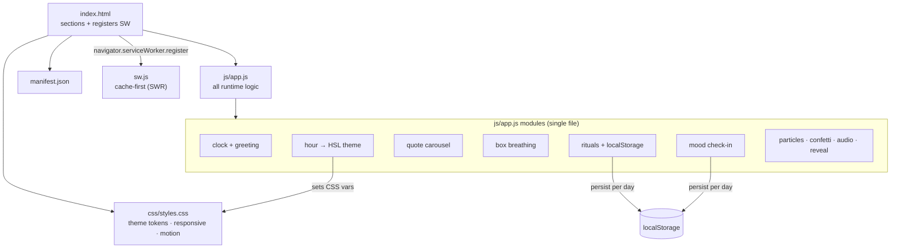

# Bom Dia

A zero-dependency, no-build **progressive web app** for a mindful morning ritual: a live clock, inspirational quotes, a guided breathing exercise, a persistent daily-rituals checklist, and a weekday focus word — all rendered from three static files (`index.html`, `css/styles.css`, `js/app.js`) with a service worker for offline use.


> The user-facing content is in **Brazilian Portuguese (pt-BR)**. The codebase and this document are in English.

## Why

Most "start your day" apps are native, account-gated, and heavy. Bom Dia is the opposite: a single-page site you can host anywhere static, install to a home screen, and open offline. It keeps no server, no account, and no analytics — the only state it stores is your own (mood and completed rituals), scoped to the current day in `localStorage`.

## Features

Every item below is implemented in `js/app.js` unless noted.

- **Live clock** — hours:minutes with a separate seconds readout and a per-minute progress bar (`tick`).
- **Context-aware greeting** — *Bom Dia / Boa Tarde / Boa Noite* switches on the current hour.
- **Time-of-day theming** — the accent color shifts across dawn / morning / day / evening / night by mapping the hour to an HSL hue, driven by CSS `@property` custom properties for smooth interpolation (`themes.auto`, `css/styles.css`).
- **Quote carousel** — 12 curated quotes, auto-advancing every 8s, with prev/next controls, a progress bar, and left/right arrow-key navigation.
- **Box breathing (4-4-4-4)** — a guided inhale / hold / exhale / pause cycle with an animated scaling circle and a per-second counter; toggle with the buttons or the spacebar.
- **Morning rituals checklist** — 6 items whose completion state persists per day in `localStorage`, with a progress bar, a confetti burst, and a short Web Audio tone on each check (`triggerConfetti`, `playSound`).
- **Mood check-in** — 5 moods, each with a tailored message, persisted for the current day.
- **Daily focus word** — a different word and reflection for each weekday (`dayFocus`, `renderFocus`).
- **Ambient canvas** — an interactive particle field in the hero that reacts to the pointer, plus a mesh-gradient background (`initParticles`, `css/styles.css`).
- **Scroll experience** — `IntersectionObserver`-driven reveal animations and an active-section dot navigation.
- **Installable & offline** — a Web App Manifest plus a cache-first (stale-while-revalidate) service worker that precaches the core assets and serves them when the network is unavailable.
- **Accessibility & polish** — ARIA roles/labels and `aria-live` regions throughout, keyboard operability, `prefers-reduced-motion` handling, and iOS safe-area insets.

## Tech stack

| Layer | Choice |
|-------|--------|
| Markup | HTML5, semantic sections |
| Styling | Modern CSS — custom properties, `@property` typed properties, `clamp()`, container-relative units, media queries |
| Behavior | Vanilla JavaScript (ES2015+), no framework, no bundler |
| Platform APIs | `IntersectionObserver`, Canvas 2D, Web Audio API, `localStorage`, Service Worker + Cache API |
| PWA | Web App Manifest, service worker (cache `bom-dia-v3`) |
| Fonts | Cormorant Garamond + Inter, loaded from Google Fonts (falls back to system serif/sans) |

There is **no `package.json`, no build step, and no dependency to install** — the browser runs the source as shipped.

## Architecture



State lives in a single `state` object; each feature is a small set of pure-ish functions wired up in one `DOMContentLoaded` handler. Theming works by having JavaScript write `--hue`/`--sat`/`--light` onto `:root`, which every component then derives its accent from — so a single hour calculation recolors the whole page.

## Getting started

### Prerequisites

Any static file server. The service worker and PWA install require an `http(s)://` or `localhost` origin — opening `index.html` directly via `file://` renders the page but disables offline caching and installability.

### Run locally

```bash
git clone <your-fork-url> bom-dia
cd bom-dia

# Option A — Python (no install)
python3 -m http.server 8080

# Option B — Node
npx serve .
```

Then open `http://localhost:8080`.

### Deploy

Copy the repository to any static host (GitHub Pages, Netlify, Cloudflare Pages, an S3 bucket, or a plain web server). No build or configuration is required. See *Limitations* for the one caveat when hosting under a sub-path.

## Project structure

```
bom-dia/
├── index.html        # Page structure, section markup, SW registration
├── manifest.json     # PWA manifest: name, colors, icon (inline SVG), shortcuts
├── sw.js             # Service worker: precache + cache-first (stale-while-revalidate) fetch
├── css/
│   └── styles.css    # Design tokens, layout, animations, responsive breakpoints
└── js/
    └── app.js        # All runtime logic (clock, theme, quotes, breathing, rituals, fx)
```

## Status & limitations

This is a **personal, self-contained front-end project**, not a production service.

- **Content is pt-BR only** and hardcoded in `js/app.js` — there is no i18n layer or content backend.
- **Persistence is local**: mood and rituals live in `localStorage`, keyed to the day and the browser. There is no sync, account, or server.
- **No automated tests** and no CI.
- **Offline uses system fonts.** The service worker skips cross-origin requests, so the Google Fonts stylesheet is not cached; offline the app falls back to the local serif/sans stack.
- **Sub-path hosting caveat**: the service worker is registered with the absolute path `/sw.js` in `index.html`. At a domain root this is fine; when served under a sub-path (e.g. a GitHub Pages *project* site at `/<repo>/`), that registration 404s and offline mode won't activate. Serve from the root, use a custom domain, or change the registration to a relative `sw.js` to enable the PWA there.

## License

Released under the [MIT License](LICENSE).
